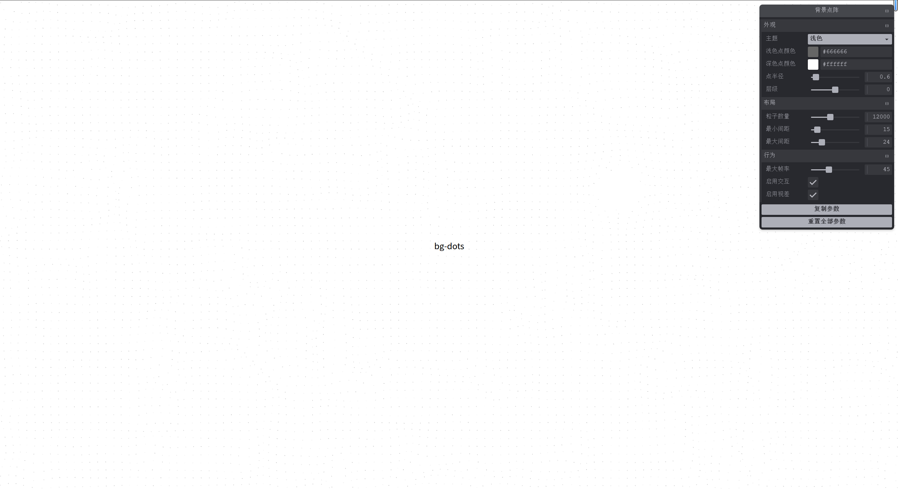
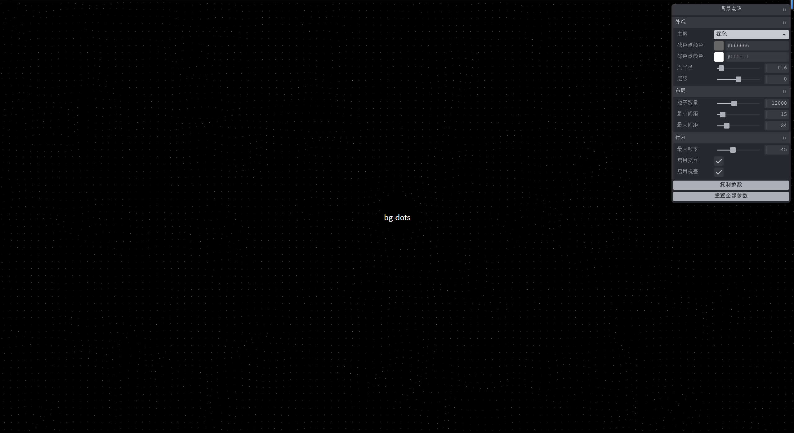

# @llds/bg-dots

一个基于 PixiJS 的轻量交互式动态背景点阵。点位会随噪声缓慢流动，鼠标靠近时避让，点击时扩散波纹。

[在线示例](https://bg-dots.pages.dev/)




## 特性

- 基于 PixiJS 的 GPU 渲染点阵动画。
- 支持浅色和深色主题，以及运行时主题切换。
- 鼠标避让、点击波纹与细指针设备视差效果。
- 提供 TypeScript 类型声明，支持 Vue 与原生 JavaScript。

## 安装

```bash
pnpm add @llds/bg-dots "pixi.js@^8.0.0" "simplex-noise@^4.0.0"
```

`pixi.js` 和 `simplex-noise` 是 peer dependencies，因此由使用方项目安装和管理。

## 使用

容器需要具有确定尺寸，并建议设置 `position: relative`，以便 canvas 在容器中绝对定位。

```html
<div id="background" class="background"></div>
```

```css
.background {
  position: fixed;
  inset: 0;
  z-index: -1;
}
```

```ts
import { createBackgroundDots } from '@llds/bg-dots'

const element = document.querySelector<HTMLElement>('#background')!
const background = createBackgroundDots(element, {
  theme: 'light',
  particleCount: 12000,
})

// 主题切换时调用
background.setTheme('dark')

// 页面/组件卸载时务必释放 WebGL 和事件监听器
background.destroy()
```

## Vue

在组件挂载后创建背景，并在卸载时释放资源：

```vue
<script setup lang="ts">
import { createBackgroundDots } from '@llds/bg-dots'

const el = shallowRef<HTMLElement>()
let background: ReturnType<typeof createBackgroundDots> | undefined

onMounted(() => {
  background = createBackgroundDots(el.value!, { theme: 'dark' })
})

onBeforeUnmount(() => background?.destroy())
</script>

<template><div ref="el" class="background" /></template>
```

## 本地示例

仓库内置 Vue 3 + Vite 交互示例页。Vue 仅为根目录的开发依赖，发布的核心包不依赖 Vue。安装依赖后运行：

```bash
pnpm demo
```

打开终端输出的本地地址即可查看；示例源文件位于 `examples/vue/`，并从构建后的包入口加载。

## 配置

| 选项 | 默认值 | 说明 |
| --- | --- | --- |
| `theme` | `'light'` | 初始主题：`'light'` 或 `'dark'` |
| `lightColor` / `darkColor` | `0x666666` / `0xFFFFFF` | 点的十六进制颜色值 |
| `particleCount` | `12000` | 目标点数，用于计算点间距 |
| `minSpacing` / `maxSpacing` | `15` / `24` | 点阵间距范围，单位 px |
| `dotRadius` | `0.6` | 点半径，单位 px |
| `maxFPS` | `45` | 最大渲染帧率 |
| `interactive` | `true` | 是否启用鼠标避让与点击波纹 |
| `parallax` | `true` | 是否在细指针设备启用视差 |
| `zIndex` | `0` | canvas 的 CSS z-index |

## API

- `createBackgroundDots(container, options)`：创建并返回实例。
- `instance.setTheme('light' | 'dark')`：立即更新所有点的颜色。
- `instance.resize()`：延迟 200ms 后重新计算点阵，通常无需手动调用。
- `instance.destroy()`：移除事件、canvas 并释放 PixiJS/WebGL 资源。

## 许可证

[MIT](LICENSE)
